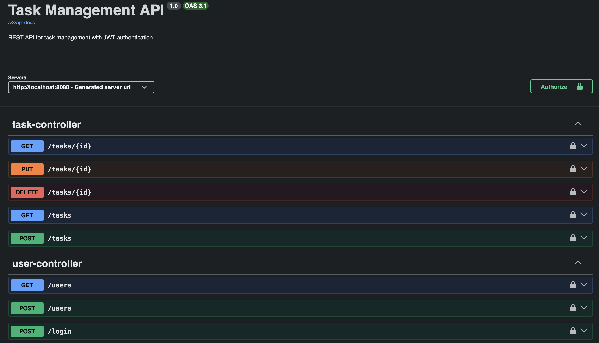

# Task Management API

API REST para gerenciamento de tarefas com autenticação de usuários utilizando JWT.

O projeto foi desenvolvido com Java e Spring Boot, com foco em desenvolvimento de APIs REST, autenticação, integração com banco de dados, testes e containerização.

## 🚀 Tecnologias

- Java 17
- Spring Boot 4.1.1
- Spring Security
- JWT
- PostgreSQL
- JPA / Hibernate
- Docker
- Docker Compose
- Swagger / OpenAPI
- JUnit
- Mockito
- Maven

## ✨ Funcionalidades

- Cadastro de usuários
- Login de usuários
- Criptografia de senhas com BCrypt
- Autenticação utilizando JWT
- Proteção de endpoints
- CRUD de tarefas
- Tarefas vinculadas ao usuário autenticado
- Controle de acesso às tarefas de cada usuário
- Validação dos dados das requisições
- Tratamento global de exceções
- Testes unitários com JUnit e Mockito
- Documentação da API com Swagger
- Aplicação containerizada com Docker
- PostgreSQL executando através do Docker Compose
- Utilização de variáveis de ambiente para configurações sensíveis

## 🏗️ Arquitetura

A aplicação utiliza uma arquitetura em camadas:

```text
Controller
    ↓
Service
    ↓
Repository
    ↓
PostgreSQL
```

### Principais camadas

**Controller**

Responsável por receber as requisições HTTP e retornar as respostas da API.

**Service**

Responsável pelas regras de negócio da aplicação.

**Repository**

Responsável pelo acesso ao banco de dados utilizando Spring Data JPA.

**Entity**

Representa as entidades e tabelas utilizadas no banco de dados.

**DTO**

Responsável pela transferência dos dados recebidos nas requisições.

**Security**

Responsável pela autenticação, autorização, criptografia das senhas e processamento dos tokens JWT.

## 🔐 Autenticação

A API utiliza **JWT (JSON Web Token)** para autenticação.

O fluxo de autenticação funciona da seguinte forma:

```text
POST /login
      ↓
AuthenticationManager
      ↓
CustomUserDetailsService
      ↓
UserRepository
      ↓
PostgreSQL
      ↓
Verificação da senha com BCrypt
      ↓
JWT gerado
      ↓
Cliente
```

Os endpoints protegidos exigem o JWT no header HTTP:

```text
Authorization: Bearer <token>
```

## 📌 Endpoints

### Usuários

| Método | Endpoint | Autenticação |
|---|---|---|
| POST | `/users` | Não |
| POST | `/login` | Não |
| GET | `/users` | Sim |

### Tarefas

| Método | Endpoint | Autenticação |
|---|---|---|
| POST | `/tasks` | Sim |
| GET | `/tasks` | Sim |
| GET | `/tasks/{id}` | Sim |
| PUT | `/tasks/{id}` | Sim |
| DELETE | `/tasks/{id}` | Sim |

## 📖 Swagger / OpenAPI

A API possui documentação interativa utilizando Swagger UI.

O Swagger permite visualizar e testar os endpoints diretamente pelo navegador, incluindo os endpoints protegidos por JWT.

### Swagger



> Coloque o arquivo do print dentro da pasta `images` com o nome `swagger.png`.

## 🐘 Banco de Dados

O projeto utiliza **PostgreSQL** como banco de dados relacional.

Principais entidades:

```text
User
  │
  └──< Task
```

Cada tarefa pertence a um usuário através de um relacionamento `ManyToOne`.

Dessa forma, um usuário autenticado só consegue acessar e modificar suas próprias tarefas.

## 🐳 Docker

A aplicação é executada em containers utilizando Docker e Docker Compose.

A estrutura possui dois containers principais:

```text
┌─────────────────────────┐
│       taskapi-app       │
│      Spring Boot API    │
│        Porta 8080       │
└────────────┬────────────┘
             │
             │
┌────────────▼────────────┐
│    taskapi-postgres     │
│       PostgreSQL        │
│        Porta 5432       │
└─────────────────────────┘
```

Para iniciar a aplicação:

```bash
docker compose up --build
```

## ⚙️ Variáveis de Ambiente

As configurações sensíveis da aplicação são armazenadas através de variáveis de ambiente.

Exemplo:

```env
POSTGRES_DB=taskapi
POSTGRES_USER=postgres
POSTGRES_PASSWORD=sua_senha
JWT_SECRET=sua_chave_jwt
```

O arquivo `.env` está incluído no `.gitignore` e não deve ser enviado para o repositório.

## 🧪 Testes

O projeto possui testes unitários utilizando:

- JUnit
- Mockito

Os testes cobrem regras de negócio como:

- Validação do cadastro de usuários
- Criação de tarefas
- Controle de acesso às tarefas
- Atualização de tarefas

Para executar os testes:

```bash
mvn clean test
```

## 📁 Estrutura do Projeto

```text
src/main/java/br/com/gerenciador/gerenciador_tarefas
│
├── config
│   ├── SecurityConfig
│   ├── JwtAuthenticationFilter
│   └── OpenApiConfig
│
├── controller
│   ├── UserController
│   └── TaskController
│
├── dto
│   ├── UserRequest
│   ├── LoginRequest
│   └── TaskRequest
│
├── entity
│   ├── User
│   └── Task
│
├── exception
│   └── GlobalExceptionHandler
│
├── repository
│   ├── UserRepository
│   └── TaskRepository
│
└── service
    ├── UserService
    ├── CustomUserDetailsService
    ├── JwtService
    └── TaskService
```

## ▶️ Como Executar

### Pré-requisitos

- Java 17+
- Docker
- Docker Compose
- Maven

### Executando a aplicação

Na raiz do projeto:

```bash
docker compose up --build
```

A API estará disponível em:

```text
http://localhost:8080
```

O Swagger estará disponível em:

```text
http://localhost:8080/swagger-ui/index.html
```

## 🔒 Segurança

O projeto implementa:

- Criptografia de senhas utilizando BCrypt
- Autenticação utilizando JWT
- Proteção dos endpoints
- Controle de acesso baseado no usuário autenticado
- Variáveis de ambiente para informações sensíveis
- Senhas não são retornadas nas respostas da API

## ☁️ Deploy

O próximo objetivo do projeto é realizar o deploy da aplicação na **AWS**, disponibilizando a API em um ambiente de produção.

## 📌 Próximos Passos

- Deploy na AWS
- Disponibilização da API publicamente
- Configuração de ambiente de produção
- Melhorias na documentação
